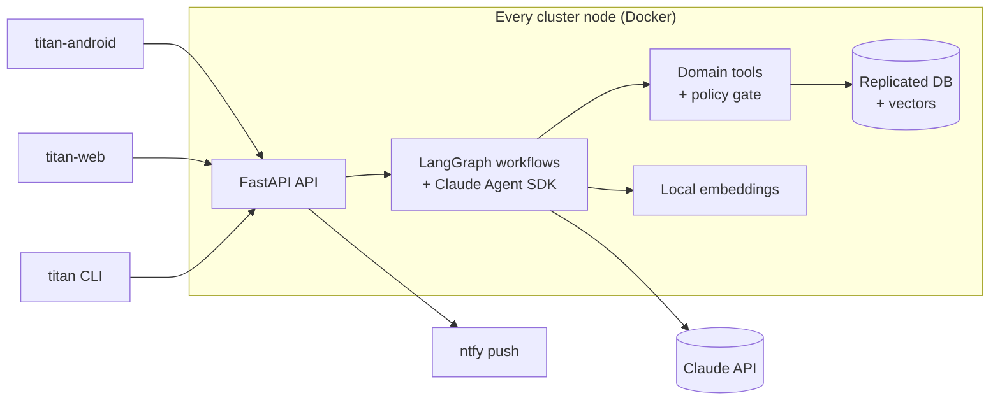

# TITAN

**A self-hosted AI assistant, planner and tracker for your household, built on the Claude Agent SDK.**


TITAN keeps track of everything you and your family care about (tasks, time,
notes, habits, health and money) and has an assistant that plans your days,
reminds you at the right moment and remembers what you told it. It runs on your
own machines, joined into a private [Tailscale](https://tailscale.com) network.
Nothing is exposed to the internet.

This repository is the **backend**: API, agent runtime, scheduler and CLI.

> **Status:** pre-alpha. The platform skeleton (API, migrations, CI) exists; the
> features in the [product spec](docs/spec/product.md) are being built along the
> [roadmap](docs/roadmap/milestones.md).

## Running locally

Needs Docker and, for development, [uv](https://docs.astral.sh/uv/).

```bash
cp .env.example .env          # set a database password
docker compose up -d          # pgEdge Postgres 18, migrations, API, worker, ntfy
curl http://127.0.0.1:8000/api/v1/health/ready
docker compose run --rm migrate titan users create <name> --owner   # first account
```

The API (port 8000) and ntfy (port 8080) are published only on
`TITAN_TAILSCALE_IP`. On a real node, set it to the node's Tailscale address
(`tailscale ip -4`). Push notifications need that real address: phones reach ntfy
through it, and the API sends pushes to it.

Chat needs a Claude credential in `.env`: `ANTHROPIC_API_KEY`, or
`TITAN_CLAUDE_AUTH_MODE=oauth` with `CLAUDE_CODE_OAUTH_TOKEN` for the owner's own
subscription ([details](docs/architecture/claude-auth.md)). Without one, chat
answers `503` and everything else works. Chat from any machine in the tailnet
with the `titan` client commands ([CLI](docs/spec/cli.md)):

```bash
uv run titan login http://127.0.0.1:8000 <name>   # pairs this machine, asks the password
uv run titan chat "Hi! What can you do?"           # streams the reply
uv run titan chat --continue "And tomorrow?"
uv run titan approvals list                        # answer what the agent asked for
```

Development without containers:

```bash
uv sync
uv run pytest
```

## Features (v1 target)

- **Chat with an agent** that streams its answers and asks before it does
  anything risky.
- **Tasks and projects** with due dates, priorities and recurrence.
- **Calendar and time planning**: the agent builds your day around fixed events
  and replans when things slip.
- **Notes and long-term memory** with semantic search.
- **Trackers** for habits, health metrics and expenses.
- **Reminders** delivered as push notifications through self-hosted ntfy.
- **Per-domain autonomy**: you choose, per domain, what the agent may do on its
  own, and every action can be audited and undone.
- **Family accounts**: private by default, shared when you choose.
- **Peer cluster**: home server, laptop and VPS, each a full node.

## Architecture



More detail: [architecture overview](docs/architecture/overview.md).

## Repositories

| Repository | Contents |
|---|---|
| [titan](https://github.com/vlukyanets/titan) | Backend, agent runtime, CLI, product spec (this repo) |
| [titan-android](https://github.com/vlukyanets/titan-android) | Android app (Kotlin, Jetpack Compose) |
| titan-web | Web UI (planned) |

## Documentation

- [Documentation index](docs/README.md)
- [Product spec](docs/spec/product.md)
- [Architecture](docs/architecture/overview.md)
- [Decisions (ADRs)](docs/adr/)
- [Roadmap](docs/roadmap/README.md)

## Contributing

Read [CONTRIBUTING](docs/CONTRIBUTING.md) for the commit and pull request rules.
AI agents also follow [CLAUDE.md](CLAUDE.md).

## License

Released into the public domain under the [Unlicense](LICENSE).
