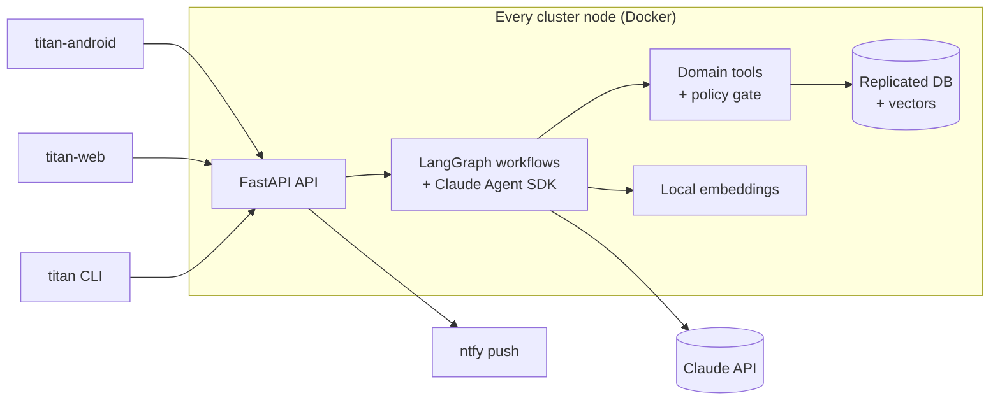

# TITAN

**A self-hosted AI assistant, planner and tracker for your household, built on the Claude Agent SDK.**

TITAN keeps track of everything you and your family care about (tasks, time,
notes, habits, health and money) and has an assistant that plans your days,
reminds you at the right moment and remembers what you told it. It runs on your
own machines, joined into a private [Tailscale](https://tailscale.com) network.
Nothing is exposed to the internet.

This repository is the **backend**: API, agent runtime, scheduler and CLI.

> **Status:** the project is in its specification phase. There is no runnable
> code yet. Start with the [product spec](docs/spec/product.md) and the
> [roadmap](docs/roadmap/milestones.md).

## Features (v1 target)

- **Chat with an agent** that streams its answers and asks before it does
  anything risky.
- **Tasks and projects** with due dates, priorities and recurrence.
- **Calendar and time planning**: the agent builds your day around fixed events
  and replans when things slip.
- **Notes and long-term memory** with semantic search.
- **Trackers** for habits, health metrics and expenses.
- **Reminders** delivered as push notifications through self-hosted ntfy.
- **Per-domain autonomy**: you choose, per domain, what the agent may do on its
  own, and every action can be audited and undone.
- **Family accounts**: private by default, shared when you choose.
- **Peer cluster**: home server, laptop and VPS, each a full node.

## Architecture

More detail: [architecture overview](docs/architecture/overview.md).

## Repositories

| Repository | Contents |
|---|---|
| [titan](https://github.com/vlukyanets/titan) | Backend, agent runtime, CLI, product spec (this repo) |
| [titan-android](https://github.com/vlukyanets/titan-android) | Android app (Kotlin, Jetpack Compose) |
| titan-web | Web UI (planned) |

## Documentation

- [Documentation index](docs/README.md)
- [Product spec](docs/spec/product.md)
- [Architecture](docs/architecture/overview.md)
- [Decisions (ADRs)](docs/adr/)
- [Roadmap](docs/roadmap/README.md)

## Contributing

Read [CONTRIBUTING](docs/CONTRIBUTING.md) for the commit and pull request rules.
AI agents also follow [CLAUDE.md](CLAUDE.md).

## License

Released into the public domain under the [Unlicense](LICENSE).
