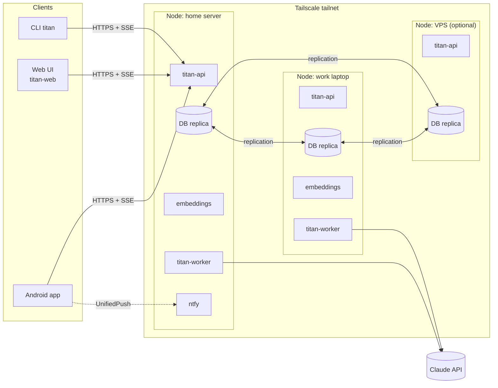
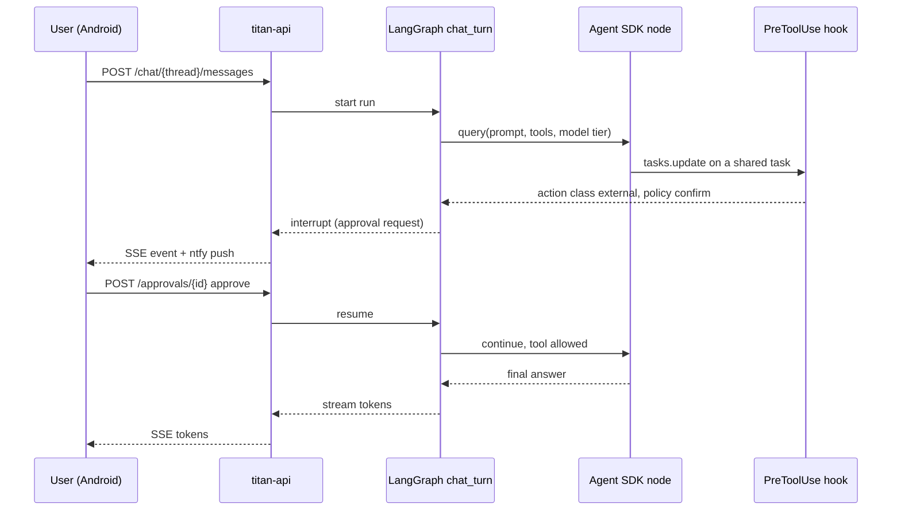

# Architecture overview

Status: **Draft**. This describes the target architecture for v1. Parts marked
*open* depend on ADRs that are still proposed.

## Deployment

TITAN runs as a set of Docker containers on every **node** of a small cluster:
a home server, a work laptop and optionally a VPS. Nodes reach each other and
the clients only through **Tailscale**. All nodes are peers: each one serves the
API, runs workflows and holds a replica of the database.



Clients connect to one node by its Tailscale name. A client that loses its node
can switch to another one; failover is a client setting in v1.

## Containers

| Container | Responsibility |
|---|---|
| `titan-api` | FastAPI app: REST + SSE/WebSocket API, auth (accounts, device tokens), domain services, OpenAPI schema |
| `titan-worker` | Runs agent workflows (chat turns, daily plan, replanning), the scheduler and reminder firing |
| `embeddings` | Local embedding model behind a small HTTP API. Separate container so it can be sized, moved to the strongest node or swapped for another model |
| `db` | PostgreSQL with pgEdge Spock (asynchronous multi-master replication) and pgvector, built and pinned by us ([ADR 0006](../adr/0006-replicated-database-with-vectors.md)) |
| `ntfy` | Push server for UnifiedPush and approval notifications |

`titan-api` and `titan-worker` are the same Python package (`uv`-managed) started
with different entry points.

## Backend layers

```text
titan/
  api/          FastAPI routers, request/response models, auth
  domains/      tasks, calendar, notes, memory, trackers, reminders
                (models, services, agent tools, policy declarations)
  agent/        LangGraph workflows, Agent SDK node wrapper, policy hook,
                Claude auth handling, model tiers, budget tracking
  scheduler/    job table, leases, recurring workflows, reminder firing
  storage/      SQLAlchemy models, repositories, vector search
  migrations/   Alembic environment and revisions
  notify/       ntfy client
  cli/          `titan` command
```

Domain code never imports from `api/` or `agent/`. Both of those depend on
`domains/`.

## Agent runtime

TITAN combines two frameworks ([ADR 0002](../adr/0002-langgraph-with-agent-sdk-nodes.md)):

- **LangGraph** defines the workflows as graphs: `chat_turn`, `daily_plan`,
  `replan`, `weekly_review`, `memory_extraction`. It owns state, branching,
  human-in-the-loop interrupts and checkpoints. Checkpoints are stored in the
  main database so any node can resume a workflow.
- **Claude Agent SDK** runs inside graph nodes that need open-ended reasoning.
  A node calls `query()` with `ClaudeAgentOptions` that set the model tier for
  that node, the domain tools the node may use, and the policy hook.
- **Domain tools** are exposed as in-process SDK MCP servers
  (`create_sdk_mcp_server`), one per domain. Built-in Claude Code tools such as
  shell and file access are disabled.
- **Policy gate**: a `PreToolUse` hook looks up the tool's action class and the
  user's policy. It allows the call, denies it, or turns it into an approval
  request. On approval requests the graph pauses with a LangGraph interrupt and
  resumes when the user answers.
- **Audit log**: a `PostToolUse` hook records every executed tool call with its
  before and after state, which makes undo possible.
- **Claude credentials** are handled as described in
  [claude-auth.md](claude-auth.md).

### Chat turn with an approval



## Storage and migrations

Database access goes through SQLAlchemy 2.x (async). Alembic manages schema
changes, which are rolled out safely across peer nodes as described in
[database-migrations.md](database-migrations.md).

Replication between nodes is asynchronous, so these rules apply to all data
access:

- **Write affinity.** API processes send writes to the preferred node (the
  home server) while it is reachable, and to their local node only when it is
  not. Spock resolves conflicts by keeping the later row image, whole rows
  at a time: the M0 spike lost a title change because the other node had
  changed only the notes of the same row. Conflicts are therefore kept to
  real partitions.
- **Update only what changed**, and model rows that several writers change at
  once (counters, streaks, aggregates) as append-only rows or Spock
  `delta_apply` columns.
- **Keys.** Primary keys are application-generated UUIDs. Natural-key unique
  constraints are rare, because two partitioned nodes can each insert the same
  key and stay diverged.
- **Conflicts are visible.** Spock's conflict records, `spock.exception_log`
  and the audit log ([ADR 0005](../adr/0005-per-domain-autonomy-policy.md))
  let the owner see and undo an edit that lost. Node clocks are kept in sync
  because conflicts are resolved by commit time.

## Scheduler and reminders

Asynchronous replication cannot guarantee that only one node runs a job, so
jobs run **at least once** and every effect is **idempotent**
([ADR 0006](../adr/0006-replicated-database-with-vectors.md)):

- Jobs (workflow runs, reminders) are rows in a replicated job table. Each job
  has a **preferred node**.
- A worker claims a job with a time-limited lease. A node other than the
  preferred one claims a job only after its lease has expired plus a grace
  period, so duplicates happen only during a real network partition. The
  preferred node is essential: without it, two nodes racing for the same jobs
  fired 20 % of them twice on a healthy cluster in the M0 spike.
- Every run has a **run id** derived from the job id and its scheduled time.
- Notifications carry the run id. The notification store and the clients drop
  a notification whose run id they have already seen.
- Workflows write their results under **deterministic keys** (for example a
  UUIDv5 of user and date for the daily plan), so a second run of the same job
  updates the same rows instead of creating new ones.

## Cost control

- Every Agent SDK call records input, output and cache tokens per user and per
  workflow.
- The model tier per graph node comes from configuration, for example
  `planner: strong`, `memory_extraction: fast`.
- Budget checks run before each call. The rules are in the
  [product spec](../spec/product.md#cost-control).

## Security baseline

- The API listens only on the Tailscale interface.
- Passwords are hashed with Argon2id. Device tokens are random, stored hashed,
  and revocable per device.
- Row-level ownership is checked in the domain services, not only in the API.
- Secrets (Claude credentials, database passwords) come from environment or
  Docker secrets, never from the repository.
- Protection of sensitive domains is *open*:
  [ADR 0007](../adr/0007-sensitive-data-protection.md).
