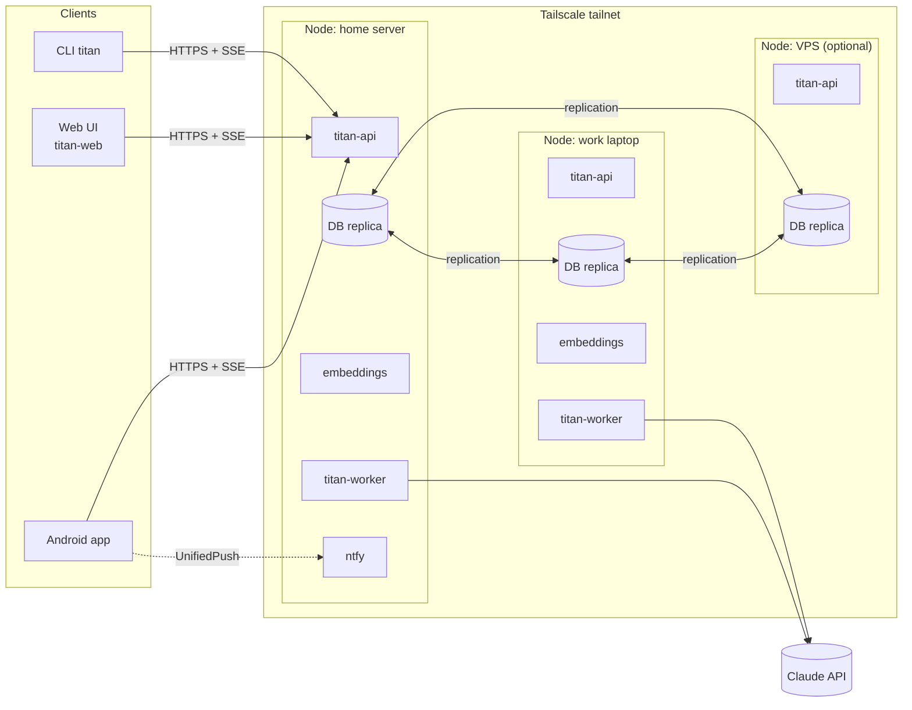
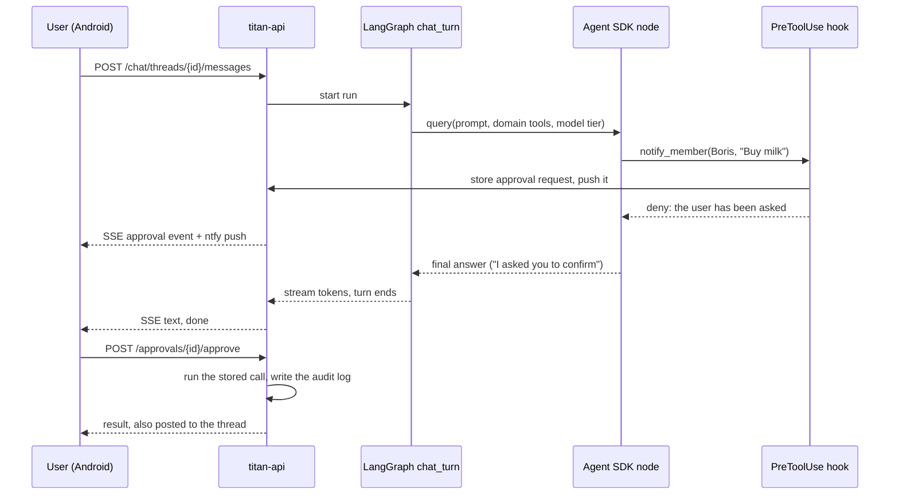

# Architecture overview

Status: **Draft**. This describes the target architecture for v1. Parts marked
*open* depend on ADRs that are still proposed.

## Deployment

TITAN runs as a set of Docker containers on every **node** of a small cluster:
a home server, a work laptop and optionally a VPS. Nodes reach each other and
the clients only through **Tailscale**. All nodes are peers: each one serves the
API, runs workflows and holds a replica of the database.



Clients connect to the cluster address `titan.<tailnet>.ts.net`, a Tailscale
Service that every ready node advertises. Tailscale sends each connection to
the nearest available node, so losing a node costs a client at most a dropped
connection ([ADR 0013](../adr/0013-one-cluster-address.md)).

## Containers

| Container | Responsibility |
|---|---|
| `titan-api` | FastAPI app: REST + SSE/WebSocket API, auth (accounts, device tokens, browser sessions), domain services, OpenAPI schema, and the static files of the Web UI |
| `titan-worker` | Runs the scheduler and reminder firing; later the agent workflows (chat turns, daily plan, replanning) |
| `embeddings` | Local embedding model behind a small HTTP API. Separate container so it can be sized, moved to the strongest node or swapped for another model |
| `db` | Replicated database with vector table support. Engine *open*: [ADR 0006](../adr/0006-replicated-database-with-vectors.md) |
| `ntfy` | UnifiedPush server for the phones. Push messages carry only notification ids ([ADR 0008](../adr/0008-push-messages-carry-references.md)) |

`titan-api` and `titan-worker` are the same Python package (`uv`-managed) started
with different entry points.

## Web UI

Every node serves the [titan-web](https://github.com/vlukyanets/titan-web)
build next to its API, on the same origin
([titan-web ADR 0002](https://github.com/vlukyanets/titan-web/blob/master/docs/adr/0002-served-by-the-node.md)).

- `TITAN_WEB_UI_DIR` names the build (`index.html` and `assets/`). Unset, the
  node serves only the API. A directory without `index.html` stops
  `titan-api` at startup.
- `/api` and everything below it is the API, and an unknown API path answers
  the usual `404` problem. `/assets/<file>` holds content-hashed files cached
  for a year (`public, max-age=31536000, immutable`); a missing one is a `404`,
  never the page. Any other `GET` or `HEAD` answers the build's file of that
  name, or `index.html` so the UI's router handles deep links, with
  `Cache-Control: no-cache`; other methods answer `405`. ETags come from the
  file contents, because release archives fix every timestamp. Hidden files
  and paths that leave the build are never served. None of these routes are
  in the OpenAPI schema.
- **The image pins a release.** `web-ui.json` holds a titan-web version and the
  SHA-256 of its release archive. The image build runs
  `scripts/fetch_web_ui.py`, which downloads the archive from the titan-web
  GitHub release, refuses it unless the hash matches, extracts it with
  Python's `data` filter into `/app/web` (owned by root, read-only for the
  service user), and sets `TITAN_WEB_UI_DIR` to it. titan-web builds its
  archives reproducibly, so the hash in the pin is the hash its CI prints.
- **Upgrading the UI** is a commit that changes `web-ui.json` to a new
  release and its hash, and a node picks it up when it is upgraded. The UI
  and the API therefore always ship together.
- **Development**: build titan-web (`pnpm build`) and start `titan-api` with
  `TITAN_WEB_UI_DIR` pointing at its `dist/`, or run the UI's development
  server, which proxies `/api` to a node.

## Backend layers

```text
src/titan/
  api/          FastAPI routers, request/response models, auth
  domains/      accounts, notifications, chat, autonomy, usage, tasks,
                calendar, notes, memory, trackers, reminders
                (models, services, agent tools, policy declarations)
  agent/        LangGraph workflows, Agent SDK node wrapper, policy hook,
                Claude auth handling, model tiers, budget tracking
  scheduler/    job table, leases, recurring workflows, reminder firing
  storage/      SQLAlchemy models, repositories, vector search
  migrations/   Alembic environment and revisions
  notify/       UnifiedPush sender (to ntfy), endpoint checks
  cli/          `titan` command: node administration (database) and the
                client commands (HTTP API, ADR 0011)
```

Domain code never imports from `api/` or `agent/`. Both of those depend on
`domains/`.

## Agent runtime

TITAN combines two frameworks ([ADR 0002](../adr/0002-langgraph-with-agent-sdk-nodes.md)):

- **LangGraph** defines the workflows as graphs: `chat_turn`, `daily_plan`,
  `replan`, `weekly_review`, `memory_extraction`. It owns state, branching,
  human-in-the-loop interrupts and checkpoints. Checkpoints are stored in the
  main database so any node can resume a workflow.
- **Claude Agent SDK** runs inside graph nodes that need open-ended reasoning.
  A node calls `query()` with `ClaudeAgentOptions` that set the model tier for
  that node, the domain tools the node may use, and the policy hook.
- **Domain tools** are exposed as in-process SDK MCP servers
  (`create_sdk_mcp_server`), one per domain. Each domain declares its tools as
  `ToolSpec`s in its own `tools.py` (action class, JSON schema, summary, undo);
  `titan.agent.tools` collects them and is the one path that runs them.
  Built-in Claude Code tools such as shell and file access are disabled.
- **Policy gate**: a `PreToolUse` hook looks up the tool's action class and the
  user's policy. It allows the call, denies it, or denies it and stores an
  approval request with the exact input. On approval TITAN runs the stored call
  itself, without the model, and posts the result to the thread
  ([ADR 0010](../adr/0010-approved-calls-run-outside-the-session.md)).
- **Audit log**: TITAN's in-process wrapper around every domain tool records
  each executed call that is not `read`, with its before and after state, which
  makes undo possible.
- **Claude credentials** are handled as described in
  [claude-auth.md](claude-auth.md).
- **Chat turns** (`titan.agent.chat`) keep only ids in their graph state, read
  the thread from the chat domain, and start a fresh Agent SDK session per turn
  ([ADR 0009](../adr/0009-chat-history-in-titan-tables.md)). The reply streams
  through the LangGraph `custom` stream. Until the worker runs agent workflows, the API
  process runs turns itself (`titan.agent.runtime`), each in a task of its own,
  so a closed connection does not stop a turn. A turn's checkpoints are deleted
  when it ends.
- **Usage and budgets**: every session's token usage and cost is recorded from
  its result message, failed sessions included (`titan.agent.usage`), which
  then checks the user's monthly budget and sends the warning or exceeded
  notification. A chat turn reads the budget state before it starts and runs on
  the `fast` tier while the budget is exceeded
  ([usage](../spec/domains/usage.md#monthly-budget)).
- **No tracing**: agent startup removes every `LANGSMITH_*` and `LANGCHAIN_*`
  variable, so LangSmith can never receive conversations.

### Chat turn with an approval



## Storage and migrations

Database access goes through SQLAlchemy 2.x (async). Alembic manages schema
changes, which are rolled out safely across peer nodes as described in
[database-migrations.md](database-migrations.md).

Nodes cannot rely on the locale their database was created with: the pgEdge
images use `C`, where `lower()`, `ILIKE` and sorting treat only ASCII letters
as letters. Case-insensitive matching in SQL uses the builtin
`pg_unicode_fast` collation (`titan.storage.collation.UNICODE`), and names that
people read are compared and sorted in Python.

## Scheduler and reminders

Asynchronous replication cannot guarantee that only one node runs a job, so
jobs run **at least once** and every effect is **idempotent**
([ADR 0006](../adr/0006-replicated-database-with-vectors.md)):

- `titan-worker` (`titan.scheduler`) runs the scheduler loop on every node.
  Every few seconds (`TITAN_SCHEDULER_TICK_SECONDS`, default 5) it tries to hold
  the lease of each sweep, and the holder does the sweep's work. The sweeps
  fire due reminders and retry pushes that no device accepted.
- A lease is a row in `scheduler_leases` with its holder and expiry
  (`TITAN_SCHEDULER_LEASE_SECONDS`, default 30). The holder renews it on every
  tick.
- One node is **preferred** (`TITAN_PREFERRED_NODE`, the home server; by
  default each node prefers itself, which is right for one node). The preferred
  node takes a lease as soon as it has expired. Any other node waits for the
  expiry plus a grace period (`TITAN_SCHEDULER_GRACE_SECONDS`, default 30), and
  a non-preferred holder gives the lease up once it sees the preferred node
  active again, so the preferred node gets it back after at most one lease
  period. Nodes are named by `TITAN_NODE_NAME` (default: the host name).
- Duplicates can then only happen during a real network partition, and their
  effects collapse: a reminder's notification id is derived from the reminder
  and the time it fired for ([reminders](../spec/domains/reminders.md)).
- Firing a reminder is a status change in the same transaction as its
  notification, taken with `SKIP LOCKED`, so on one node it fires once.

## Cost control

- Every Agent SDK call records input, output and cache tokens per user and per
  workflow.
- The model tier per graph node comes from configuration, for example
  `planner: strong`, `memory_extraction: fast`.
- Budget checks run before each call. The rules are in the
  [product spec](../spec/product.md#cost-control).

## Security baseline

- The API listens only on the Tailscale interface.
- Every response carries the headers of
  [ADR 0012](../adr/0012-browser-sessions-for-the-web-ui.md):
  `Strict-Transport-Security`, a `Content-Security-Policy` that allows only
  the node's own scripts and requires Trusted Types, `X-Content-Type-Options`,
  `Referrer-Policy`, `Cross-Origin-Opener-Policy`,
  `Cross-Origin-Resource-Policy` and `Permissions-Policy`. API responses are
  also `Cache-Control: no-store`. One ASGI middleware adds them without
  buffering streamed replies. The node sends no CORS headers, and it has no
  interactive API docs, because those load scripts from a CDN.
- Passwords are hashed with Argon2id. Device tokens are 256-bit random values,
  stored only as SHA-256 digests, and revocable per device
  ([accounts and devices](../spec/accounts.md)).
- Row-level ownership is checked in the domain services, not only in the API.
- The server sends pushes only to endpoints on configured push servers, without
  following redirects, and push messages contain no user content
  ([notifications](../spec/domains/notifications.md)).
- Secrets (Claude credentials, database passwords) come from environment or
  Docker secrets, never from the repository.
- Protection of sensitive domains is *open*:
  [ADR 0007](../adr/0007-sensitive-data-protection.md).
