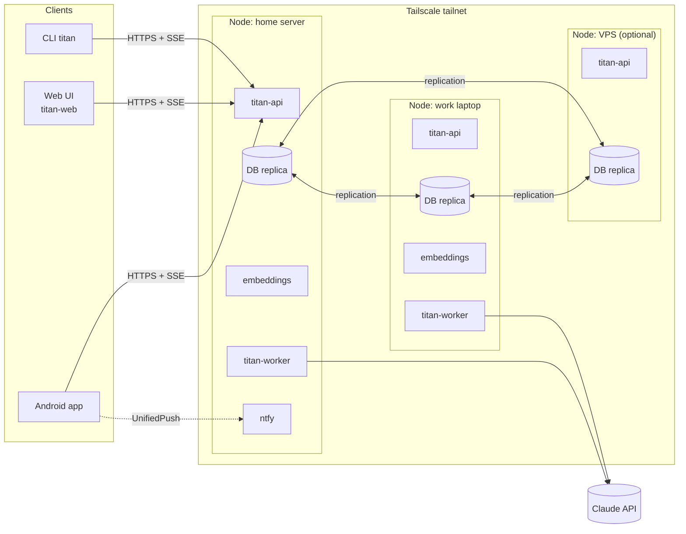
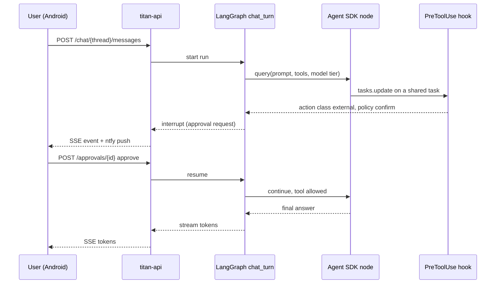

# Architecture overview

Status: **Draft**. This describes the target architecture for v1. Parts marked
*open* depend on ADRs that are still proposed.

## Deployment

TITAN runs as a set of Docker containers on every **node** of a small cluster:
a home server, a work laptop and optionally a VPS. Nodes reach each other and
the clients only through **Tailscale**. All nodes are peers: each one serves the
API, runs workflows and holds a replica of the database.



Clients connect to one node by its Tailscale name. A client that loses its node
can switch to another one; failover is a client setting in v1.

## Containers

| Container | Responsibility |
|---|---|
| `titan-api` | FastAPI app: REST + SSE/WebSocket API, auth (accounts, device tokens), domain services, OpenAPI schema |
| `titan-worker` | Runs agent workflows (chat turns, daily plan, replanning), the scheduler and reminder firing |
| `embeddings` | Local embedding model behind a small HTTP API. Separate container so it can be sized, moved to the strongest node or swapped for another model |
| `db` | Replicated database with vector table support. Engine *open*: [ADR 0006](../adr/0006-replicated-database-with-vectors.md) |
| `ntfy` | UnifiedPush server for the phones. Push messages carry only notification ids ([ADR 0008](../adr/0008-push-messages-carry-references.md)) |

`titan-api` and `titan-worker` are the same Python package (`uv`-managed) started
with different entry points.

## Backend layers

```text
src/titan/
  api/          FastAPI routers, request/response models, auth
  domains/      accounts, notifications, tasks, calendar, notes, memory,
                trackers, reminders
                (models, services, agent tools, policy declarations)
  agent/        LangGraph workflows, Agent SDK node wrapper, policy hook,
                Claude auth handling, model tiers, budget tracking
  scheduler/    job table, leases, recurring workflows, reminder firing
  storage/      SQLAlchemy models, repositories, vector search
  migrations/   Alembic environment and revisions
  notify/       UnifiedPush sender (to ntfy), endpoint checks
  cli/          `titan` command
```

Domain code never imports from `api/` or `agent/`. Both of those depend on
`domains/`.

## Agent runtime

TITAN combines two frameworks ([ADR 0002](../adr/0002-langgraph-with-agent-sdk-nodes.md)):

- **LangGraph** defines the workflows as graphs: `chat_turn`, `daily_plan`,
  `replan`, `weekly_review`, `memory_extraction`. It owns state, branching,
  human-in-the-loop interrupts and checkpoints. Checkpoints are stored in the
  main database so any node can resume a workflow.
- **Claude Agent SDK** runs inside graph nodes that need open-ended reasoning.
  A node calls `query()` with `ClaudeAgentOptions` that set the model tier for
  that node, the domain tools the node may use, and the policy hook.
- **Domain tools** are exposed as in-process SDK MCP servers
  (`create_sdk_mcp_server`), one per domain. Built-in Claude Code tools such as
  shell and file access are disabled.
- **Policy gate**: a `PreToolUse` hook looks up the tool's action class and the
  user's policy. It allows the call, denies it, or turns it into an approval
  request. On approval requests the graph pauses with a LangGraph interrupt and
  resumes when the user answers.
- **Audit log**: a `PostToolUse` hook records every executed tool call with its
  before and after state, which makes undo possible.
- **Claude credentials** are handled as described in
  [claude-auth.md](claude-auth.md).

### Chat turn with an approval



## Storage and migrations

Database access goes through SQLAlchemy 2.x (async). Alembic manages schema
changes, which are rolled out safely across peer nodes as described in
[database-migrations.md](database-migrations.md).

## Scheduler and reminders

- Jobs (workflow runs, reminders) are rows in a replicated job table.
- A worker claims a job by taking a time-limited **lease** on it. Exactly-once
  firing across peers depends on how the chosen database handles concurrent
  writes. This is an acceptance criterion for
  [ADR 0006](../adr/0006-replicated-database-with-vectors.md).

## Cost control

- Every Agent SDK call records input, output and cache tokens per user and per
  workflow.
- The model tier per graph node comes from configuration, for example
  `planner: strong`, `memory_extraction: fast`.
- Budget checks run before each call. The rules are in the
  [product spec](../spec/product.md#cost-control).

## Security baseline

- The API listens only on the Tailscale interface.
- Passwords are hashed with Argon2id. Device tokens are 256-bit random values,
  stored only as SHA-256 digests, and revocable per device
  ([accounts and devices](../spec/accounts.md)).
- Row-level ownership is checked in the domain services, not only in the API.
- The server sends pushes only to endpoints on configured push servers, without
  following redirects, and push messages contain no user content
  ([notifications](../spec/domains/notifications.md)).
- Secrets (Claude credentials, database passwords) come from environment or
  Docker secrets, never from the repository.
- Protection of sensitive domains is *open*:
  [ADR 0007](../adr/0007-sensitive-data-protection.md).
